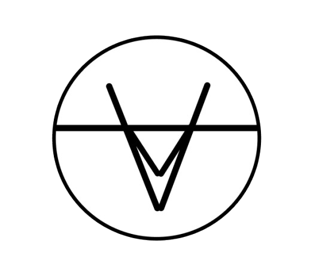

<!DOCTYPE html>
<html lang="en">

<head>
    <meta charset="UTF-8">
    <meta name="viewport" content="width=device-width, initial-scale=1.0">
    <title>Future Ukraine</title>
    <link rel="preconnect" href="https://fonts.googleapis.com">
    <link rel="preconnect" href="https://fonts.gstatic.com" crossorigin>
    <link href="https://fonts.googleapis.com/css2?family=Montserrat:ital,wght@0,100..900;1,100..900&display=swap" rel="stylesheet">
    <link rel="stylesheet" href="future-ukr.css">
</head>

<body>

    <header> 

        <nav class="menu">
    
            

    
                
    
            

    
            
 
    
                <ul class="first_ul">
                    <li class="first_li"><a class="first_a" href="#Start">Вступ</a></li>
                    <li class="first_li"><a class="first_a" href="#Info">Наше бачення</a></li>
                    <li class="first_li"><a class="first_a" href="#End">Підсумки</a></li>
                </ul>
    
            

    
        </nav>
               
    </header>
   
    <section class="navigation_on_foto" >
    
        <h1> Майбутнє України </h1>
  
    </section>

    <main>

      

        
            

                На сьогоднішній день Україна проживає важкі часи, щодня борячись за свободу та незалежність. З приходом ворога на наші землі, українці втратили: 
                свої домівки, сім’ї, спокій, але не втратили віру. Дякуючи нашим захисникам, які боронять нашу країну, ми маємо можливість навчатися, працювати 
                та планувати майбутнє наскільки це можливо. Адже саме ми власноруч, своїми силами, відбудуємо нашу Батьківщину.  Ця стаття присвячена нашим думкам 
                про майбутнє України, як ми його бачимо, і для того щоб вони втілилися в реальність потрібно вірити в нашу перемогу, в ЗСУ та докладати максимум зусиль.
            

            

              Слава Україні!    Героям Слава!
            

           
      

    
      

    
          <ul class="slider">
            <li class="item" style="background-image: url('https://kor.ill.in.ua/m/1200x0/2877921.jpeg')"></li>
            <li class="item" style="background-image: url('https://static.ukrinform.com/photos/2024_02/thumb_files/630_360_1708840876-817.jpg')"></li>
            <li class="item" style="background-image: url('https://pravdatutnews.com/sites/default/files/news/2022/06/24/viyna.jpg')"></li>
            <li class="item" style="background-image: url('https://img.pravda.com/images/doc/b/4/b49090c-vij-na--most-dnepr-info-.jpg')"></li>
            <li class="item" style="background-image: url('https://static.ukrinform.com/photos/2023_09/thumb_files/630_360_1694276574-223.jpg')"></li>
          </ul>

          

            Наслідки вторгнення росії
          

    
      

      

            

                Не дивлячись ні на що, росія не забере у нас силу волі, своду і можливість мріяти та втілювати їх в реальність. Ми вірим що майбутня Україна буде ще красивішою, ще сильнішою і ще розвинітішою
            

      

    
      

        
        

  
          
Освіта

          
Наука

          
Медицина

          
Екологія

          
Міжнародні відносини

          
Культура

        

     

      

        <button class="close-btn" onclick="close_box(0)">&times;</button>

        <h2 style="text-align: center; color: #ffffff;font-family: Arial, Helvetica, sans-serif; font-size: 52px;">Освіта</h2>
        

        
         <h4 style="color: #ffffff; padding: 10px 35px; font-family: Arial, Helvetica, sans-serif; text-align: justify; font-size: 18px; flex: 1;">
          З початком війни українці навчилися пристосовуватись до складних обставин і знаходити нові рішення для продовження життя. Це стосується і навчання,
           діти побували в різних ситуаціях, таких як дистанційне навчання і навіть офлайн навчання у бомбосховищі під час повітряних тривог. Саме цей досвід 
           допоможе зробити нашу освіту ще більш гнучкішою та ефективнішою. За роки розвинуться нові освітні платформи, які зроблять освіту більш доступнішими. 
           Зявляться нові предмети для кращого розуміння ситуації в теперішньому і майбутньому пов’язані з військовою підготовкою, історію та розвиненням критичного мислення.
            А найголовніше, що з кінцем війни повернуться вчителі, науковці і звичайно ж діти, які зможуть навчати і вчитися на своїй Батьківщині. Можлив в майбутньому Україна 
            стане лідер у Європі за якістю освіти.</h4>
            
        

       
      

      
      

        <button class="close-btn" onclick="close_box(1)">&times;</button>
        <h2 style="text-align: center; color: #ffffff;">Наука</h2>
        

          <h4 style="color: #ffffff; padding: 10px 35px; font-family: Arial, Helvetica, sans-serif; text-align: justify; font-size: 18px; flex: 1;">
            Наука почне стрімко розвиватися у різних сферах, але при цьому більшу увагу будуть приділяти військовим технологіям, кібербезпеці та медицині.
             Держава та бізнеси почнуть більше інвестувати в наукові дослідження, що надасть можливість молодим науковцям реалізувати їхні ідеї у реальність.</h4>
        
        
        

      

      

        <button class="close-btn" onclick="close_box(2)">&times;</button>
        
        <h2 style="text-align: center; color: #ffffff;">Медицина</h2>
        

          
          <h4 style="color: #ffffff; padding: 10px 35px; font-family: Arial, Helvetica, sans-serif; text-align: justify; font-size: 18px; flex: 1;">
            Після війни почнуть відкриватися нові реабілітаційні центри, для військових та громадян хто постраждав. Окрім цього медицина розвинеться в сфері протезів та в лікуванні
             військових травм. Незважаючи на важке минуле наша медицина може вийти на новий рівень та стати лідером в виготовлені якісних протезів по всьому світу.</h4>
             
        

    
      

      

        <button class="close-btn" onclick="close_box(3)">&times;</button>
       
        <h2 style="text-align: center; color: #ffffff;">Екологія</h2>
        

          <h4 style="color: #ffffff; padding: 10px 35px; font-family: Arial, Helvetica, sans-serif; text-align: justify; font-size: 18px; flex: 1;">
            Після війни почнеться масова відбудова країни, адже війна завдала дуже великих збитків навколишньому середовищу. Розпочне свою роботу маштабна 
            програма екологічного відновлення України, до неї буде входити розміновування території, очищення довкілля та відновлення лісів. </h4>
        
        
        

      

      

        <button class="close-btn" onclick="close_box(4)">&times;</button>
       
        <h2 style="text-align: center; color: #ffffff;">Міжнародні відносини</h2>
        

          
          <h4 style="color: #ffffff; padding: 10px 35px; font-family: Arial, Helvetica, sans-serif; text-align: justify; font-size: 18px; flex: 1;">
            Завдяки своїй перемозі Україна доведе іншим країнам, що вона є незламною та сильною і завдяки цьому зможе налагодити дружні зв’язки з іншими країнами. Також нам 
            дадуть членство в ЄС та Нато, що надасть гарантію безпеки країни. Військовий досвід України допоможе перебудувати європейську систему безпеки, окрім цього буде 
            розвивати співпрацю зі світом.</h4>
            
        

      

      

        <button class="close-btn" onclick="close_box(5)">&times;</button>
       
        <h2 style="text-align: center; color: #ffffff;">Культура</h2>
        

          <h4 style="color: #ffffff; padding: 10px 35px; font-family: Arial, Helvetica, sans-serif; text-align: justify; font-size: 18px; flex: 1;">
            Наразі українська музика, кіно та література набирають популярність за кордоном. Тому можемо припустити, що після нашої перемоги культура України 
            стане ще більш відомішою по всьому світі, адже співаки, режисери, продюсери і тд будуть надихатися героїчними вчинкам, історіями про сильних духом 
            людей та перемогою України. Окрім цього зруйнована окупантами культурна спадщина буде відновлена і буде можливість створити нові архітектурні споруди 
            сучасного світу. </h4>
        
        
      

      

        
    

    

       
  </main>

  <footer style="background-color: rgb(0, 0, 0);">

    <!--<h2 style="color: white; text-align: center;">Ми студентки Вінницького національного технічного університету</h2>-->
      
    
 <!--цей клас можна буде забрати, АЛЕ НЕ ФАКТ-->
      

      

       
        Незважаючи на дану ситуацію в Україні, вона всерівно матиме світле майбутнє. Адже, це не перший раз наша країна переживає 
        важкі часи. Згадайте про численні репресії, голодомори, війни, повстання....
       
 Україна вистояла тоді і вистоїть зараз. Головне для нас наразі не забувати,
         що ми українці – сильна нація, яка не дозволить чужинцям правити нами та нашими землями. Ми повинні вірити, надіятися та боротися, 
         для того щоб наблизити нашу країну до перемоги.
 
       
  Сподіваємося, що вже зовсім скоро усі українці прокинуться у вільній і незалежній 
        Україні. Всі захисники та захисниці повернуться до своїх родин. І ми усі почнемо відбудовувати незалежну, сильну, процвітаючу та єдину Україну.

       
 Україна понад усе! 

     

     <!-- -->

    

  </footer>
   

</body>

</html>
